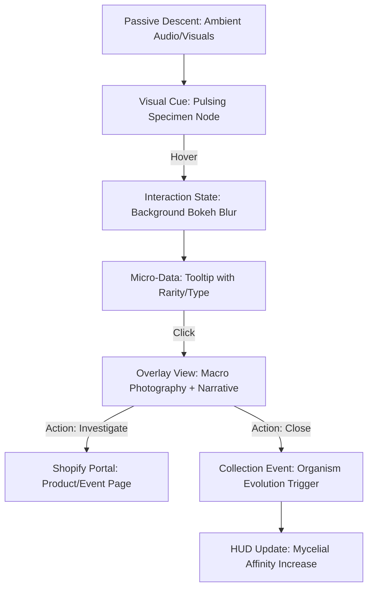

stepsCompleted: [1, 2, 3, 4, 5, 6, 7, 8, 9, 10, 11, 12, 13, 14]
inputDocuments: ['_bmad-output/planning-artifacts/prd.md', '_bmad-output/planning-artifacts/architecture.md']
---

# UX Design Specification Sotabosc

**Author:** Cherukara
**Date:** 2026-03-15

---

<!-- UX design content will be appended sequentially through collaborative workflow steps -->

## Executive Summary

### Project Vision
Sotabosc is a vertical ecological cross-section—an 'anti-website' that rewards curiosity and slow exploration. The core UX patterns prioritize immersion (Ecosystem Descent) and identity (Generative Organism evolution) over extraction.

### Target Users
- **Slow Culture Enthusiasts**: Artists, foragers, and designers who find standard commerce sites 'flattening'.
- **The Curious Wanderer**: Visitors arriving via organic discovery who stay for the atmospheric wonder.
- **The Returning Inhabitant**: Users who return to see their organism identity age and grow.

### Key Design Challenges
- **The 'Un-Site' Balance**: Maintaining a mystical, nav-less feel while ensuring the Shopify 'Portal to Archive' (commerce) is discoverable and usable.
- **Atmospheric Performance**: Ensuring a high-fidelity continuous scroll maintains a premium 60fps feel across devices.
- **Identity Retention**: Building emotional belonging through the Organism Card HUD without forced sign-ups.

### Design Opportunities
- **Biomimetic Navigation**: Using HSL-based lighting and sound cross-fades as the primary directional 'map'.
- **Staggered Archives**: A gallery grid that feels like a biology field journal rather than a shop grid.

## Core User Experience

### Defining Experience
The core of Sotabosc is **Vertical Descent (The Drift)**. It is a weighted, atmospheric passage through biological time. The user is not a 'visitor' but an 'inhabitant' whose presence is recorded by the ecosystem.

### Platform Strategy
- **Desktop-First Browser Immersion**: Primary focus is a cinematic, wide-screen browser experience. The app utilizes the full horizontal vista of a desktop display to create a sense of 'Scale & Smallness'.
- **Liquid Scroll (Mouse & Wheel)**: Navigation is optimized for high-precision scrolling and damping, moving away from 'app-style' tapping towards fluid, cinematic drifting.
- **Zero-Login Retention**: Persistence is handled via local storage to minimize 'digital friction'.

### Effortless Interactions
- **Wide-Area Discovery**: Specimen Nodes are staggered across the wide horizontal plane, encouraging the user to 'scan' the forest like a naturalist.
- **Bioluminescent Cues**: Interactive nodes (Specimens) reveal themselves through soft pulses, removing the need for 'CTA' buttons.
- **Peripheral HUD**: The Organism Card is a persistent but quiet companion, utilizing `backdrop-blur-3xl` to mesh with the forest.

## Desired Emotional Response

### Primary Emotional Goals
- **Awe & Scale**: The user should feel the literal weight of the forest. The wide-screen 'Descent' makes them feel small in an ancient system.
- **Mystical Presence**: A feeling that the user is an 'invited guest' or 'temporary inhabitant' in a biological machine.
- **Speculative Wonder**: Curiosity driven by the 'alien' yet grounded biological assets.

### Emotional Journey Mapping
- **Entry (Sky)**: Airy, light, a sense of falling.
- **Descent (Canopy/Understory)**: Increasing tension, mystery, and intimacy with the specimens.
- **Collection (Gallery)**: A sense of quiet accomplishment and archival stewardship.

### Micro-Emotions
- **Intrigue (Hover)**: Subtle glow changes as the mouse nears a node.
- **Soft Connection**: When the Organism Card 'pulses' in sync with a discovery.

### Design Implications
- **Wide Aspect Depth**: Using parallax to make the 'Understory' feel infinitely deep.
- **No Sharp UI**: Every UI element is rounded and glassmorphic to avoid breaking the organic immersion.

## UX Pattern Analysis & Inspiration

### Inspiring Products Analysis

#### Max Mara Puzzles (Narrative Discovery)
- **UX Success**: The use of abstract, painterly interactions to reveal a narrative. It rewards patience over efficiency.
- **Compelling Factor**: The "hide-and-seek" mechanic where the interface is the puzzle itself.
- **Atmosphere**: A high-end, premium feel that values "the drift" through content.

#### Interactive Documentaries (e.g., National Geographic Wide-Scenes)
- **UX Success**: Using the full horizontal vista of the desktop for world-building.
- **Interaction**: Non-linear exploration where the "story" is found in the corners of the screen.

### Transferable UX Patterns

**Investigation Pattern**
- Reward the user for hovering over "empty" spaces. The "Max Mara" principle of discovery through investigation.

**Atmospheric Layering**
- Using visual "depth of field" (Gaussian blur on foreground fronds) to guide the eye toward interactive nodes in the mid-ground.

**Biomimetic HUD**
- An interface that doesn't feel like an "app layer" but like a tool the inhabitant is carrying into the forest.

### Anti-Patterns to Avoid

- **Standard "Commerce" Grids**: Using a 4-column product grid would immediately break the immersion of the Understory.
- **Predictable Tooltips**: Avoid the "Rectangle-with-Tail" tooltip. Any information pop-up must feel like a biological "outgrowth" or a glassmorphic reflection.
- **Global Navigation Bars**: Sticky headers are forbidden. Navigation must be internal to the world's vertical flow.

### Design Inspiration Strategy

**What to Adopt**
- **Investigative Discovery**: We will hide "Specimen Nodes" in the deep shadows of the Wide-Scene, requiring the user to scan the forest.

**What to Adapt**
- **Wide-Area Parallax**: Adapting the standard vertical parallax to work for a wide, scannable desktop horizon.

**What to Avoid**
- **Efficiency UX**: We are intentionally designing "Inefficient Discovery" to encourage atmospheric dwelling.

## Design System Foundation

### Design System Choice: Custom Biomimetic System
For Sotabosc, we reject standard UI libraries (Material, Ant) in favor of a **Custom Biomimetic System** built on Vanilla CSS and Framer Motion primitives.

### Rationale for Selection
- **Visual Uniqueness**: Standard components break the "Portal to Archive" immersion.
- **Dynamic Growth**: The system must support "Evolving Tokens" (border thickness, glow intensity, and pattern complexity) that change based on user state.
- **Performance**: High-fidelity wide-screen parallax requires a lean, tailor-made layer architecture.

### Implementation Approach
- **Tokens**: HSL-based color tokens paired with "Bloom" and "Blur" variables.
- **Motion**: A unified "Liquid Damping" config for all transitions.
- **EvoGraphic primitive**: A custom SVG component used across the Card and the World to ensure symbiotic visual unity.

### Customization Strategy: Ecosystem-Identity Sync
The world is not static. We will implement "Thematic Tints" where the global HSL tokens of the forest shift slightly to align with the user's Organism Card domain (e.g., warmer greens for Fungi, cooler cyans for Microbes).

### Critical Success Moments
- **The Threshold**: The emotional shift when entering the Sky layer from the landing screen.
- **The Discovery**: The realization that 'products' are biological archives found in the forest.

### Experience Principles
1. **Atmosphere Over Commerce**: The ecosystem always comes first.
2. **Biological Integrity**: Every interaction must feel organic, not transactional.
3. **Weight & Drift**: Navigation mirrors physical gravity and descent.
4. **The Quiet HUD**: UI elements stay in the periphery until summoned.

## Defining the Core Experience

### Defining Experience: The Symbiotic Identity
The defining interaction of Sotabosc is the **Mirroring of Presence**. The user identifies with a specific biological domain, and the forest responds to that identity through HSL tints, soundscapes, and the visual evolution of the **Organism Card**.

### User Mental Model: "The Resident"
Users should not see themselves as "customers" but as "residents" or "stewardship nodes". Their mental model is more akin to a gardening journal or a wildlife camera feed than a shop.

### Success Criteria: "The Amazing Card"
- **Identity Imagery**: Every card MUST display a high-fidelity biological asset (Animal, Plant, etc.) that anchors the name and stats.
- **Micro-Evolution**: Visual cues (veins, fractal borders) update in real-time as the user discovers new specimens.
- **Atmospheric Sync**: The forest Floor density or Sky clarity should feel tied to the user's affinity score.

### Experience Mechanics: The Descent Loop
1. **Reception**: Choosing a domain and receiving the first "Seedling" card.
2. **Descent**: Vertical drift through layers, triggering context-aware sound and light.
3. **Investigation**: Hovering and clicking "Specimen Nodes" to collect fragments.
4. **Resonance**: The card evolves visually as collection count grows, increasing the "Archon" grade.

## Design Direction Decision

### Design Directions Explored

#### 1. Cinematic Horizon (Wide Vista)
- **Concept**: A 21:9 ultra-wide view of the Understory, emphasizing horizontal scannability and atmospheric depth.
- **Visuals**: Soft-blurred foreground ferns framing a deep indigo forest floor. 
- **Interaction**: 'Symbiosis Pulse' waves that reveal scattered specimens.

#### 2. Specimen Investigation (Macro Focus)
- **Concept**: An intimate, detailed view of a single specimen when hovered or clicked.
- **Visuals**: Deep bokeh effect on the forest background, bringing the biological textures into sharp focus.
- **Interaction**: 'Outgrowth' tooltips that feel like biological extensions of the specimen.

### Chosen Direction: The Atmospheric Hybrid
We will combine the **Cinematic Horizon** for navigation with the **Specimen Investigation** for detail views. This allows for both "Scale & Smallness" (wide view) and "Microscopic Wonder" (detail focus).

### Design Rationale
- **Immersion**: The wide aspect ratio pulls the desktop user into the world.
- **Patience**: The investigation pattern rewards the user for slowing down.
- **Identity**: The organic tooltips reinforce that the user is interacting with an archive of life, not a database.

### Implementation Approach
- **Layer Architecture**: 3-layer parallax in the Wide Horizon (Foreground, Interactive Midground, Deep Void).
- **Post-Processing**: Using CSS filters (blur, brightness, contrast) to achieve the bokeh shift during investigation.
- **Asset Pipeline**: Using high-fidelity photographic assets for all specimens in the investigation view.

## User Journey Flows

### Flow 1: The Descent to Identity (First Entry)
This flow handles the transition from "Visitor" to "Resident". It balances the mystery of the world with the need for a grounded identity.

```mermaid
graph TD
    A[Landing Page: "Enter the Forest"] --> B{Identity State?}
    B -- Anonymous --> C[Domain Selection: "What are you?"]
    B -- Existing --> D[Direct Descent: Foreground active layer]
    
    C -- Select Domain --> E[Identity Generation: Procedural Card]
    C -- Skip --> F[Anonymous Mode: Neutral 6-Layer Access]
    
    E --> G[The Descent: Active Layer Audio/Visual Lead]
    F --> G
    
    G --> H[Discovery Point: First Specimen Hotspot]
```

### Flow 2: The Curiosity Loop (Investigation & Collection)
The core micro-interaction for discovering the Shopify-integrated artifacts.



### Flow 3: The Evolutionary Return (Loyalty Loop)
How the user interacts with the world over many "Seasons" (visits).

```mermaid
graph TD
    A[Return Visit: URL Type-in] --> B[HUD Identity: Age/Species Reveal]
    B -- Check Growth --> C[Evolution Check: New SVG Ornaments]
    
    C --> D[Ambient Pulse: Notification of New Layers/Links]
    D -- Descend --> E[Targeted Discovery: New Content in "Home" Layer]
    
    E --> F[Investigation -> Collection]
    F --> G[Identity Maturation: "Archon" Grade Upgrade]
```

### Journey Patterns
1. **Damped Transition**: No hard page loads between world states; everything is handled via GSAP/Framer transitions to maintain immersion.
2. **Progressive Disclosure**: Technical stats are only revealed after the user shows intent (hover/click), keeping the primary view artistic.
3. **Identity Mirroring**: The world responds to the user's specific domain (e.g., Fungi visitors see more "Mycelial Dust" particulates).

### Flow Optimization Principles
- **Atmospheric Delay**: Intentionally slowing down transitions to force scannability.
- **Low-Friction Identity**: Zero-login persistence via `localStorage` is the default.
- **Graceful Exit**: Always providing a clear path back to the "Forest" from a detailed investigation overlay.

## Visual Design Foundation

### Color System: Bioluminescent Dark Mode
The palette is rooted in deep, atmospheric shadows to make bioluminescent accents feel like light sources rather than just colors.

- **Primary (Shadows)**: `hsl(210, 30%, 5%)` - Deep forest-night blue/black.
- **Accent 1 (Bioluminescence - Cyan)**: `hsl(190, 80%, 50%)` - For Microbes and Algae.
- **Accent 2 (Bioluminescence - Pink/Magenta)**: `hsl(330, 80%, 60%)` - For Fungi and Earth.
- **Surface**: `hsla(210, 30%, 10%, 0.4)` with `backdrop-blur-3xl`.
- **Contrast**: Text uses `hsl(0, 0%, 95%)` for primary and `hsl(0, 0%, 60%)` for secondary.

### Typography System: Technical Narrative
We pair a rigid, futuristic sans-serif with an elegant, traditional serif to represent the "Laboratory Journal" meet "Ancient Forest" theme.

- **Heading (Narrative)**: **Newsreader** (Serif) - Used for organism names and layer titles. It evokes a biology textbook or a formal record.
- **UI/Data (Technical)**: **Space Grotesk** (Sans-Serif) - Used for the HUD, stats, and identity hashes. It represents the digital observer's interface.
- **Scale**: A wide dynamic range from `10px` (hashes) to `4rem` (Layer titles).

### Spacing & Layout Foundation: Cinematic Wide-View
The layout rejects the standard mobile-first "stack" in favor of a **Cinematic Horizontal Vista**.

- **Viewport Principle**: Elements are pinned to the edges of the wide-screen view to create a sense of scale.
- **White Space**: Excessive. Elements are allowed to "breathe" in the void, forcing the user to scan the scnee.
- **Grid**: A non-standard 12-column grid that is primarily used for the Specimen Node jittering, avoiding perfect vertical alignment.

### Accessibility Considerations
- **Color Contrast**: Bioluminescent accents are high-vibrancy to ensure they stand out against deep backgrounds.
- **Motion Reduction**: A global toggle will disable the parallax and damping for users with sensitivity.
- **Font Clarity**: Space Grotesk is chosen for its high legibility at tiny sizes for data-dense cards.

## Component Strategy

### Design System Components
We leverage a **Biomimetic Primitive** set built on Vanilla CSS and Framer Motion.

- **EvoGraphic**: Procedural SVG generator for organism identity.
- **AtmosphericHUD**: A `backdrop-blur-3xl` glassmorphic panel.
- **SpecimenNode**: A pulsing, interactive hotspot primitive.

### Custom Components

#### 🎥 CinematicHorizon
**Purpose**: A 21:9 aspect-ratio container that enforces the cinematic horizon layout on desktop while gracefully collapsing to verticality on mobile.
**Interaction**: Anchors the 3-layer parallax depth.

#### 🌫️ BokehOverlay
**Purpose**: A full-screen transition component that applies a heavy Gaussian blur filter to the background ecosystem when a specimen is investigated.
**States**: Active (Blur 20px), Inactive (Blur 0px).

#### 🧬 BioTooltip
**Purpose**: An "outgrowth" style hover-label that appears near Specimen Nodes.
**Anatomy**: Small Newsreader title, Space Grotesk meta-data, and a tiny bioluminescent dot.

### Component Implementation Strategy
- **Tokens Over Classes**: Use the HSL tokens defined in Step 8 for all glow and shadow effects.
- **Damping Cohesion**: All UI elements must use the same Framer Motion `transition={{ type: "spring", damping: 30, stiffness: 200 }}` to feel part of the same "liquid" environment.

### Implementation Roadmap

#### Phase 1: The Resident's Tools
- `CinematicHorizon`: Essential for the Step 9 vision.
- `BioTooltip`: To support the "Investigation" journey.

#### Phase 2: Resonance Upgrades
- `ArchonOrnaments`: Additional generative SVG paths for the Organism Card as affinity increases.
- `EcosystemPulse`: Background radial ripples for environmental feedback.

## Responsiv- [x] Step 13: Responsive & Accessibility
- [x] Step 14: Finalize UX Design
We prioritize a "Cinematic Desktop" experience but ensure the ecosystem remains navigable and evocative on touch devices.

- **Desktop (21:9 Focus)**: The primary vista. Wide margins, extreme horizontal scannability, and rich hover states.
- **Tablet**: Maintain the 3-layer parallax. Increase Specimen Node touch targets to `64px`. Replace hover effects with "Tap-to-Focus" logic.
- **Mobile**: The horizontal vista collapses into a vertical "Gallery" column. Parallax is reduced to `2 layers` (Midground & Deep Void) to preserve 60fps performance on low-power mobile GPUs.

### Breakpoint Strategy
- **Mobile**: `< 768px`. Layout is strictly vertical.
- **Tablet**: `768px - 1024px`. Transitions from vertical stack to wide horizon.
- **Desktop (Cinematic)**: `> 1024px`. Full wide-vista activation.

### Accessibility Strategy (WCAG 2.1 AA)
- **Visual**: Maintain a `4.5:1` contrast ratio for all technical data in Space Grotesk.
- **Motion**: A global `prefers-reduced-motion` listener will automatically flatten all layers and disable the damped liquid scroll.
- **Keyboard**: Logical tab order through Specimen Nodes follows the vertical descent.

### Testing Strategy
- **Visual Regression**: Testing that the `CinematicHorizon` correctly pins elements across 16:9 and 21:9 monitors.
- **Lighthouse A11y**: Target score of `95+` for the world shell.

### Implementation Guidelines
- **Relative Units**: Use `vh` for layer heights and `clamp()` for typography to ensure scale fluidly across the wide vista.
- **Semantic Layers**: Each ecosystem zone uses `<section aria-labelledby="...">` to ensure screen readers can navigate the descent contextually.
